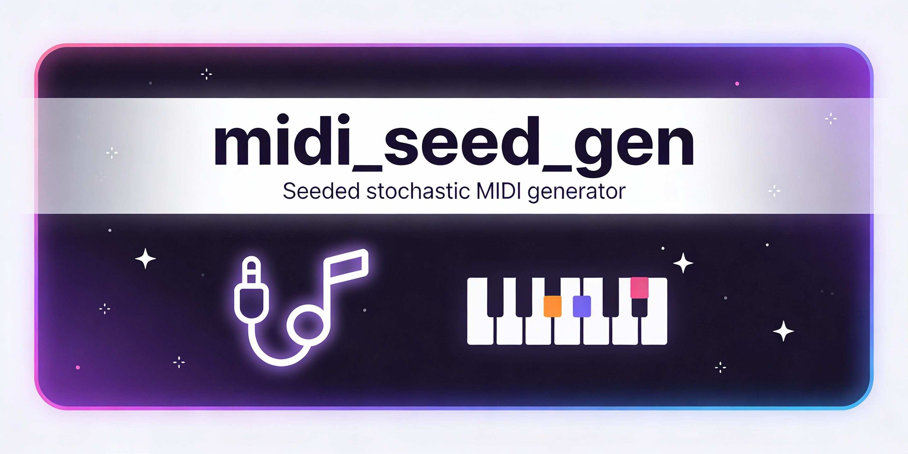

[README.md]

<p align="center">
  <a href="https://github.com/ljunggrenaudio/ljunggrenaudio/random-midi-gen-util/releases"> 
     
  </a>
  <a href="https://github.com/ljunggrenaudio/random-midi-gen-util/actions"> 
     
  </a>
  <a href="https://github.com/whisprer/woflang-alpha-r/blob/main/LICENSE"> 
     
    
  </a>
  
  
</p>

 
 
 
[](https://github.com/ljunggrenaudio/random-midi-gen-util) 


<p align="center">
  


---

# random-midi-gen-util
makes musical `.mid` files at random-ish


Seeded random MIDI (format 0) generator that writes a single-track `.mid` containing tempo, program change, and a stochastic melody constrained to a chosen scale.
​
Because it’s seeded, the same arguments will always produce the same output file contents (useful for reproducible “random” ideas).
​

Quick start
```bash
cargo run -- --help
cargo run -- --seed 123 --bpm 120 --bars 16 --root C4 --scale minor-pentatonic
```

What the tool generates
- Standard MIDI File `format 0` (one track, all events in that track).
​
- A tempo meta event at `time 0` (Set Tempo stores microseconds per quarter note).
​
- A Program Change at `time 0` to suggest an instrument/patch to the receiving synth/DAW.
​
- Note On/Note Off events quantized to a `1/16 grid`.
​

CLI usage (matches `--help`)
Usage:
```text
midi_seed_gen.exe [OPTIONS]
```

Options (verbatim from the current binary output):

`-o`, `--out <OUT>`: Output .mid path (if omitted, a timestamped name is generated)

`--seed <SEED>`: RNG seed (same seed => same MIDI) [default: 12648430]

`--bpm <BPM>`: Tempo in BPM [default: 120]

`--bars <BARS>`: Bars (assumes 4/4) [default: 16]

`--ppqn <PPQN>`: Ticks per quarter note (PPQN) [default: 480]

`--root <ROOT>`: Root note in scientific pitch notation (e.g. C4, A3, F#5, Db2) [default: C4]

`--scale <SCALE>`: Scale / mode [default: minor-pentatonic] [possible values: major, natural-minor, minor-pentatonic, major-pentatonic]

`--channel <CHANNEL>`: MIDI channel (0..15). (Channel 9 is the “10th channel” used for drums in GM practice.) [default: 0]

`--program <PROGRAM>`: Program (0..127). 0 = Acoustic Grand Piano in General MIDI [default: 0]
​

Notes on pitch (`--root`)
`--root` accepts note names like C4, C#4, Db4, etc., and converts them into MIDI note numbers (0–127).
​
Middle C is MIDI note 60, but octave numbering (“is middle C called C3 or C4?”) can vary between systems, so this tool follows the “C4 = 60” convention used by many SPN mappings.


Examples
Generate multiple ideas without overwriting (auto timestamped filenames):

```bash
cargo run -- --seed 1 --root C4 --scale major-pentatonic
cargo run -- --seed 2 --root C3 --scale minor-pentatonic
cargo run -- --seed 3 --root C4 --scale natural-minor
```

Write to an explicit filename (overwrites if it already exists):
```bash
cargo run -- --out out/take.mid --seed 999 --bpm 140 --bars 32 --root F#3 --scale major
```

---

